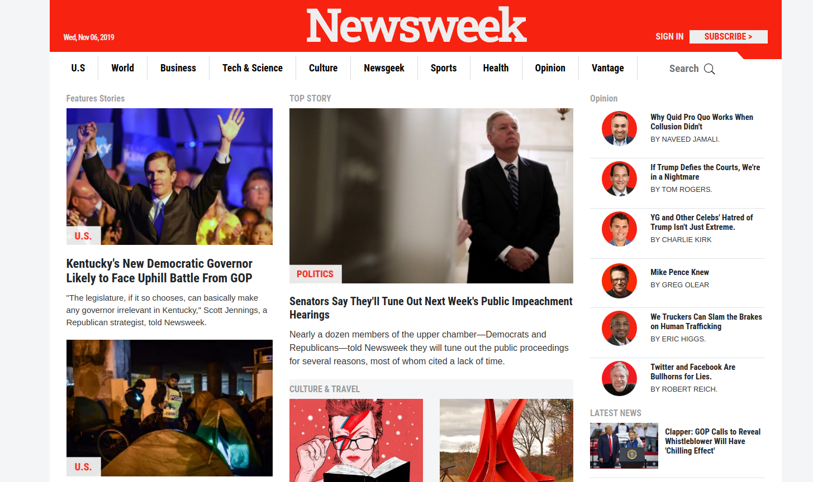

[![Contributors][contributors-shield]][contributors-url]
[![Forks][forks-shield]][forks-url]
[![Stargazers][stars-shield]][stars-url]
[![Issues][issues-shield]][issues-url]
[![LinkedIn][linkedin-shield2]][linkedin-url2]
[![Hireable][hireable]][hireable-url]

<!-- PROJECT LOGO -->
 

  <h2 align="center"> Responsive Web Design</h2>

  

    Project developed with HTML5, CSS3 and Bootstrap that shows a responsive web design of NewsWeek homepage.
     
    <a href="https://github.com/YairFernando67/NewsWeek"><strong>Explore the docs »</strong></a>
     
     
    <a href="https://github.com/YairFernando67/NewsWeek">View Demo</a>
    ·
    <a href="https://github.com/YairFernando67/NewsWeek/issues">Report Bug</a>
    ·
    <a href="https://github.com/YairFernando67/NewsWeek/issues">Request Feature</a>
  

<!-- TABLE OF CONTENTS -->
## Table of Contents

* [About the Project](#about-the-project)
  * [Built With](#built-with)
* [Contact](#contact)
* [Contributing](#Contributing)
* [Show your support](#Show-your-support)

<!-- ABOUT THE PROJECT -->
## About The Project

This is a responsive web design based on NewsWeek.

### Built With
The project was developed using these tools and technologies.
* [CSS3](https://developer.mozilla.org/en-US/docs/Web/CSS)
* [HTML5](https://www.w3schools.com/html/)
* [Bootstrap](https://getbootstrap.com/docs/4.3/getting-started/introduction/)
* [Reset CSS File](https://necolas.github.io/normalize.css/)

<!-- CONTACT -->

## Contact

👤 **Yair Fernando Facio**

- Github: [@YairFernando67](https://github.com/YairFernando67)
- Twitter: [@YairFernando18](https://twitter.com/YairFernando18)
- Linkedin: [softwaredeveloperyairfacio](https://www.linkedin.com/in/softwaredeveloperyairfacio/)
- Email: [yair.facio11@gmail.com](https://mail.google.com/mail/?view=cm&fs=1&tf=1&to=yair.facio11@gmail.com)
- Portfolio: [softwaredeveloper](https://yairfernando67.github.io/Portfolio/)

Project Link: [https://github.com/YairFernando67/NewsWeek](https://github.com/YairFernando67/NewsWeek)

## 🤝 Contributing

Contributions, issues and feature requests are welcome!

Feel free to check the [issues page](https://github.com/YairFernando67/NewsWeek/issues).

## Show your support

Give a ⭐️ if you like this project!

<!-- MARKDOWN LINKS & IMAGES -->

[contributors-shield]: https://img.shields.io/github/contributors/YairFernando67/NewsWeek.svg?style=flat-square
[contributors-url]: https://github.com/YairFernando67/NewsWeek/graphs/contributors
[forks-shield]: https://img.shields.io/github/forks/YairFernando67/NewsWeek.svg?style=flat-square
[forks-url]: https://github.com/YairFernando67/NewsWeek/network/members
[stars-shield]: https://img.shields.io/github/stars/YairFernando67/NewsWeek.svg?style=flat-square
[stars-url]: https://github.com/YairFernando67/NewsWeek/stargazers
[issues-shield]: https://img.shields.io/github/issues/YairFernando67/NewsWeek.svg?style=flat-square
[issues-url]: https://github.com/YairFernando67/NewsWeek/issues
[license-shield]: https://img.shields.io/github/license/YairFernando67/NewsWeek.svg?style=flat-square
[license-url]: https://github.com/YairFernando67/NewsWeek/blob/master/LICENSE.txt
[linkedin-shield2]: https://img.shields.io/badge/-LinkedIn-black.svg?style=flat-square&logo=linkedin&colorB=555
[linkedin-url2]: https://www.linkedin.com/in/softwaredeveloperyairfacio/
[hireable]: https://cdn.rawgit.com/hiendv/hireable/master/styles/flat/yes.svg
[hireable-url]: https://www.linkedin.com/in/softwaredeveloperyairfacio/

